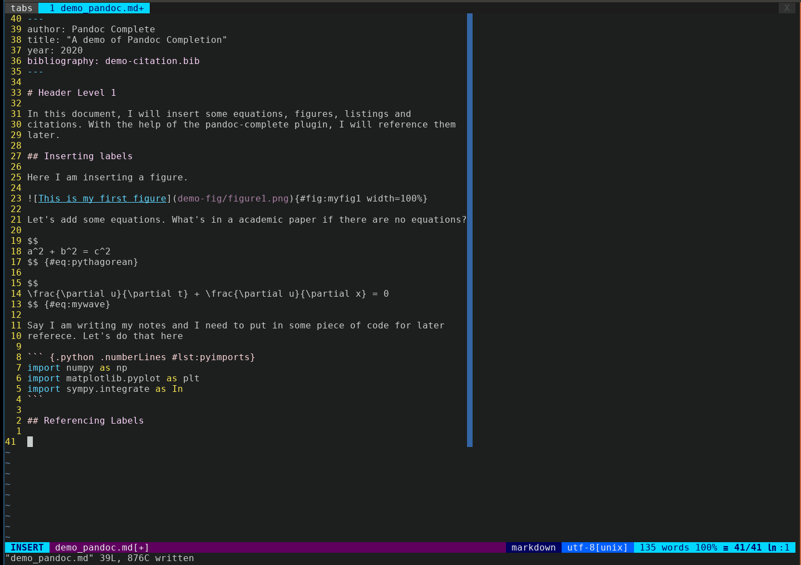

# Completion menu in Pandoc-style markdown files

## Introduction

If you write academic documents in vim using Pandoc style markdown files and
utilize the pandoc-crossref and pandoc-citeproc filters for cross-referencing
and citations, you will find this plugin useful. This plugin sets the
`'omnifunc'` option (`:h compl-omni`) and populates the completion menu with
reference labels for figures, equations, tables, listing, sections and
citations.

Let's look at an example to understand the functionality that this plugin
provides. Say the currently edited markdown file has a number of places where
figures are inserted. Each figure has a label written in `pandoc-crossref`
style: `#fig:somefigname`. There are several such labels scattered across
current markdown file. Now you start to enter text and you need to insert
reference to a particular label but do not exactly remember what the name of
the label is.  If you have this plugin installed, you could fire-up a
completion menu in insert mode by entering (`CTRL-X CTRL-O`). You will get a
popup menu list containing all the labels that are defined in the current
document.  You could keep on typing few more characters and this list keeps
getting shorter dynamically, responding to the characters that you typed. When
your list gets sufficiently shorter, you could use `CTRL-N`, `CTRL-P` or
`CTRL-Y` to accept the suggested entry.

Relying on the completion menu to insert your references ensures accuracy by
eliminating the chances of a typo.



This plugin makes use of the built-in omnicomplete functionality of vim, and is
therefore superlight. For more detailed information on omni completion and
insert completion in general please read the help docs (`:h ins-completion`).

## Pre-requisites

This plugin was developed on a Linux Box and uses `grep` and `sed` programs.
These are available by default on most Linux distributions, but double check
just to be sure. On OSX and Windows machines, you may need to manually install
these two programs.

## Installation

Use your favorite plugin manager to install this plugin, which is recommended
because you can easily keep all your plugins updated.

If you wish to manually install this plugin using vim's native plugin manager,
you can do so using the following steps:

- `mkdir -p ~/.vim/pack/myplugins/start`
- `cd !$`
- `git clone https://github.com/patashish704/pandoc-complete.git`

Here you can change `myplugins` to any other directory name, but the rest of the
components of the path should remain the same.

## Configuration

In your `~/.vimrc` file, set the following option:

``` vim
set completeopt=menuone,noinsert
```

This will allow you to dynamically filter completion menu entries as you type
in more characters in insert mode.

Additionally, the following global variables are available to tailor this
plugin to suit individual needs:

### Global variables---`g:PandocComplete_figdirtype` and `g:PandocComplete_figdirpre`

If you use figures in your markdown file, and your figure is not in the current
directory, then you need to set these variable in your `~/.vimrc`.

If `g:PandocComplete_figdirtype` is set to `1` and `g:PandocComplete_figdirpre`
is set to a string, say `"figures"`, then the png file is searched in that
directory, e.g., `figures/example.png`.

If `g:PandocComplete_figdirtype` is set to `2` and `g:PandocComplete_figdirpre`
is set to a string say, `"_fig-"`, and your current markdown buffer name is,
say `myexamplemarkdown.md`, then the png files are searched in a directory
called `_fig-myexamplemarkdown/`

*Default Values* (Refers to current directory):

    g:PandocComplete_figdirtype : 0
    g:PandocComplete_figdirpre : ""

*Example*: For the demo in the gif above, I have used the following settings:

``` vim
let g:PandocComplete_figdirtype = 1
let g:PandocComplete_figdirpre = 'demo-fig'
```

## Usage

This plugin populates the omni-completion menu from the following sources

- `[Figure], [Equation], [Listing], [Section], [Table]`: Labels of figures,
  equations, listings, sections and tables that are present in the currently
  edited markdown file.
- `[Citation]` Keys in your bibliography file (.bib file)
- `[ins-Figure]`: Name of figure (relative path) that you wish to insert in the
  currently edited markdown file. Note that authors usually keep their figures
  in a separate folder. Only those figure names will appear in the
  omni-completion menu that are not yet inserted in the currently edited
  markdown file.

While in insert mode, press `CTRL-X CTRL-O`, which is the builtin key-chord for
launching omni-completion menu. You will see all the items listed above in this
menu. Keep on typing more characters to narrow down your search; the menu will
dynamically become shorter. When the menu becomes sufficiently short (usually
to 3-4 entries), you can press `CTRL-X CTRL-N` or `CTRL-X CTRL-P` to make a
selection.

The bibliography file can be included in the yaml header in one of the
following two formats:

``` yaml
bibliography: mycitations.bib
```

or

``` yaml
bibliography:
    - citations/mycitations.bib
    - someothersource.bib
```

Keep saving your document periodically. This will refresh the completion list
and add to it any new labels that you entered in the markdown document.
